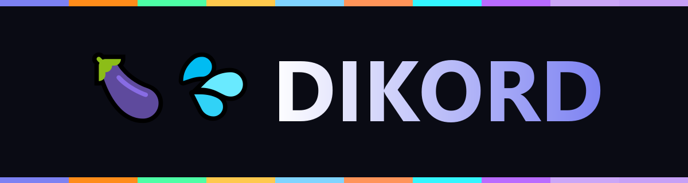
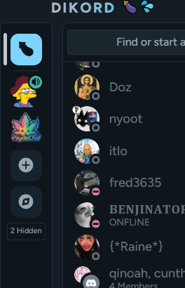
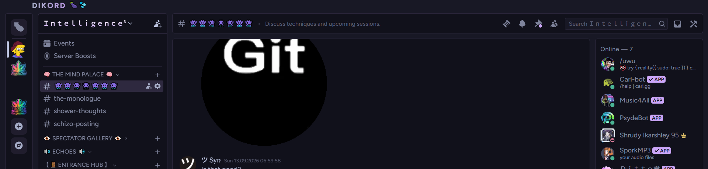
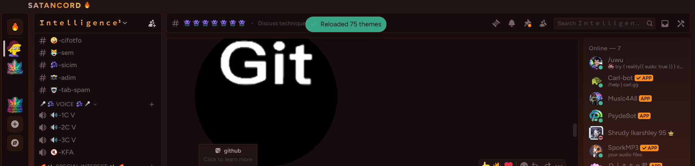
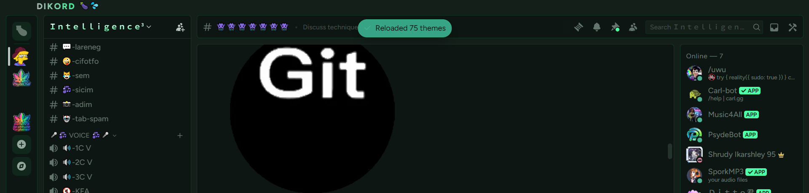
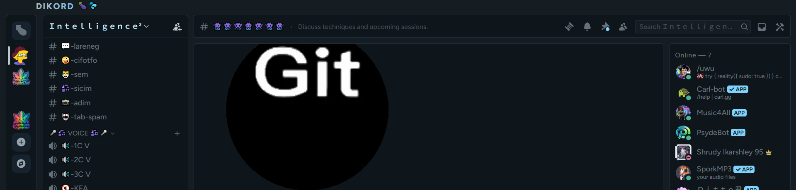
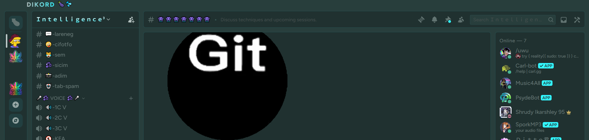
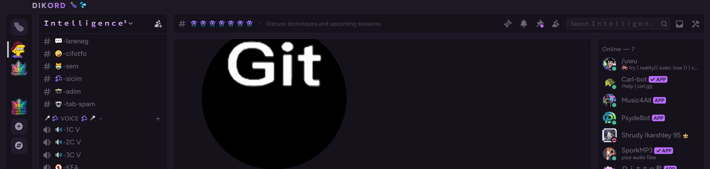

  

  
  

<i>10 discord themes. the avatars spin when you hover them in the actual app. that's the whole pitch.</i>

real footage. real spinning. real hidden servers.

 

<a href="https://raw.githubusercontent.com/Chimthuwu/Dikord/main/DIKORD.theme.css"><b>DIKORD</b></a> ·
<a href="https://raw.githubusercontent.com/Chimthuwu/Dikord/main/DIKORD-Crimson.theme.css"><b>SATANCORD</b></a> ·
<a href="https://raw.githubusercontent.com/Chimthuwu/Dikord/main/DIKORD-Emerald.theme.css"><b>Emerald</b></a> ·
<a href="https://raw.githubusercontent.com/Chimthuwu/Dikord/main/DIKORD-Gold.theme.css"><b>Gold</b></a> ·
<a href="https://raw.githubusercontent.com/Chimthuwu/Dikord/main/DIKORD-IceBlue.theme.css"><b>Ice Blue</b></a> ·
<a href="https://raw.githubusercontent.com/Chimthuwu/Dikord/main/DIKORD-Sunset.theme.css"><b>Sunset</b></a> ·
<a href="https://raw.githubusercontent.com/Chimthuwu/Dikord/main/DIKORD-Teal-Neon.theme.css"><b>Teal Cyan</b></a> ·
<a href="https://raw.githubusercontent.com/Chimthuwu/Dikord/main/DIKORD-Violet.theme.css"><b>Violet</b></a> ·
<a href="https://raw.githubusercontent.com/Chimthuwu/Dikord/main/DIKORD-CatppuccinMocha.theme.css"><b>Catppuccin Mocha</b></a> ·
<a href="https://raw.githubusercontent.com/Chimthuwu/Dikord/main/DIKORD-CatppuccinMacchiato.theme.css"><b>Catppuccin Macchiato</b></a>

 

<h3 align="center">not mockups. real discord. real ugly channel names.</h3>

yes that's a github webhook avatar taking up the whole screen. no we're not cropping it out.

 <b>DIKORD</b>

 <b>SATANCORD</b>

 <b>Emerald</b>

 <b>Ice Blue</b>

 <b>Teal Cyan</b>

 <b>Violet</b>

 

  

click a name to grab that theme's .css. throw it in your Vencord/Equicord themes folder. flip it on. spin stuff.

🍆💦

