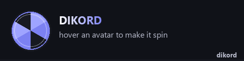
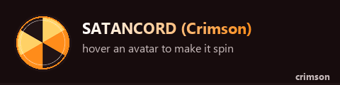
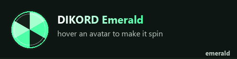
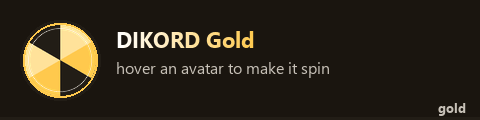
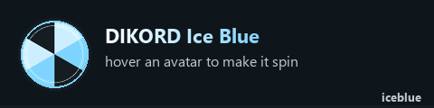
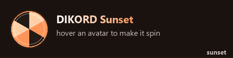
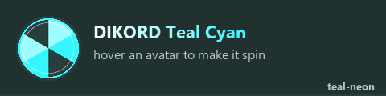
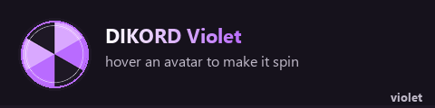
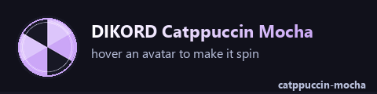
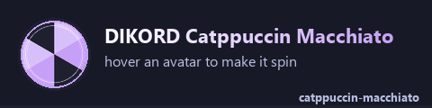

  

  
  

<i>10 discord themes. the avatars spin when you hover them. that's the whole pitch.</i>

 

<table align="center">
<tr>

<td align="center" width="50%">
 
<b><a href="https://raw.githubusercontent.com/Chimthuwu/Dikord/main/DIKORD.theme.css">DIKORD</a></b> 
the one that started it all
</td>

<td align="center" width="50%">
 
<b><a href="https://raw.githubusercontent.com/Chimthuwu/Dikord/main/DIKORD-Crimson.theme.css">SATANCORD</a></b> 
hell mode. repent later
</td>

</tr>
<tr>

<td align="center" width="50%">
 
<b><a href="https://raw.githubusercontent.com/Chimthuwu/Dikord/main/DIKORD-Emerald.theme.css">Emerald</a></b> 
if money had a personality
</td>

<td align="center" width="50%">
 
<b><a href="https://raw.githubusercontent.com/Chimthuwu/Dikord/main/DIKORD-Gold.theme.css">Gold</a></b> 
bling bling discord
</td>

</tr>
<tr>

<td align="center" width="50%">
 
<b><a href="https://raw.githubusercontent.com/Chimthuwu/Dikord/main/DIKORD-IceBlue.theme.css">Ice Blue</a></b> 
brain freeze aesthetic
</td>

<td align="center" width="50%">
 
<b><a href="https://raw.githubusercontent.com/Chimthuwu/Dikord/main/DIKORD-Sunset.theme.css">Sunset</a></b> 
juice box orange
</td>

</tr>
<tr>

<td align="center" width="50%">
 
<b><a href="https://raw.githubusercontent.com/Chimthuwu/Dikord/main/DIKORD-Teal-Neon.theme.css">Teal Cyan</a></b> 
cyberpunk lite
</td>

<td align="center" width="50%">
 
<b><a href="https://raw.githubusercontent.com/Chimthuwu/Dikord/main/DIKORD-Violet.theme.css">Violet</a></b> 
grape drank
</td>

</tr>
<tr>

<td align="center" width="50%">
 
<b><a href="https://raw.githubusercontent.com/Chimthuwu/Dikord/main/DIKORD-CatppuccinMocha.theme.css">Catppuccin Mocha</a></b> 
coffee-pilled
</td>

<td align="center" width="50%">
 
<b><a href="https://raw.githubusercontent.com/Chimthuwu/Dikord/main/DIKORD-CatppuccinMacchiato.theme.css">Catppuccin Macchiato</a></b> 
coffee-pilled but soft
</td>

</tr>
</table>

 

<h3 align="center">not mockups. real discord. real ugly channel names.</h3>

yes that's a github webhook avatar taking up the whole screen. no we're not cropping it out.

 <b>DIKORD</b>

 <b>SATANCORD</b>

 <b>Emerald</b>

 <b>Ice Blue</b>

 <b>Teal Cyan</b>

 <b>Violet</b>

 

  

click a gif to grab that theme's .css. throw it in your Vencord/Equicord themes folder. flip it on. spin stuff.

🍆💦

